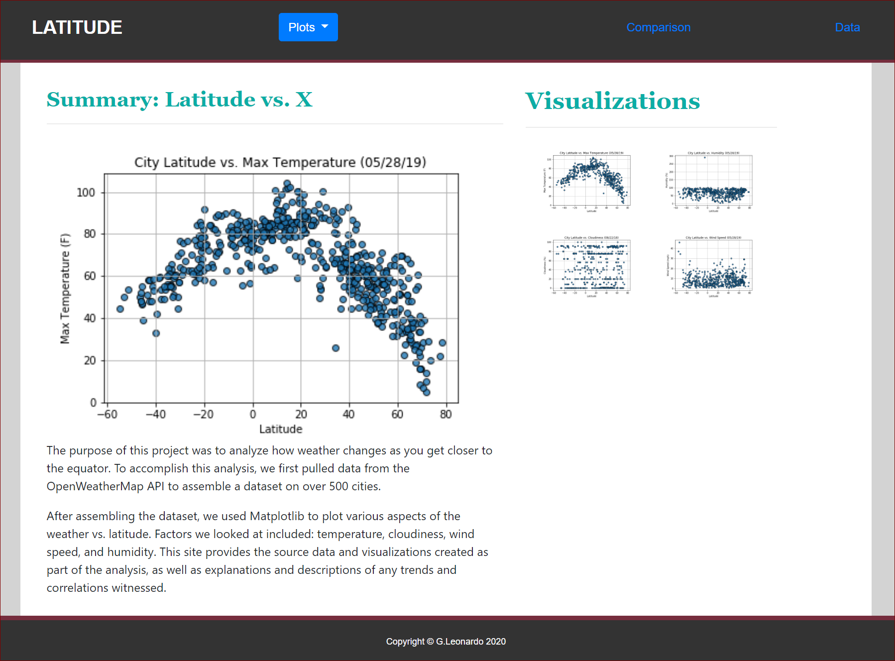

# Web-Design-Challenge
Web Design - Web Visualization Dashboard

## Latitude - Latitude Analysis Dashboard with Attitude

The website consist of 7 pages total, including:
- A landing page containing:
    - An explanation of the project
    - Links to each visualization page.
- Four visualization pages, each with:
    - Descriptive title and heading tag.
    - Plot/visualization itself for the selected comparison.
    - A paragraph describing the plot and its significance.
- A Comparisons' page that:
    - Contains all of the visualizations on the same page so we can easily visually compare them.
    - Uses a bootstrap grid for the visualizations.
        - The grid with two visualizations across on screens medium and larger, and 1 across on extra-small and small screens.
    - A Data page that:
        - Displays a responsive table containing the data used in the visualizations.
            - The table must be a bootstrap table component.
            - he data must come from exporting the .csv file as HTML, or converting it to HTML. Try using a tool you already know, pandas. Pandas has a nifty method approprately called to_html that allows you to generate a HTML table from a pandas dataframe.
The website have navigation menu at the top that:
    - Has the name of the site on the left of the nav which allows users to return to the landing page from any page.
    - Contains a dropdown on the right of the navbar named "Plots" which provides links to each individual visualization page.
    - Provides two more links on the right: "Comparisons" which links to the comparisons page, and "Data" which links to the data page.
    - Is responsive (using media queries). The nav must have similar behavior as the screenshots "Navigation Menu" section (notice the background color change).
    
 
